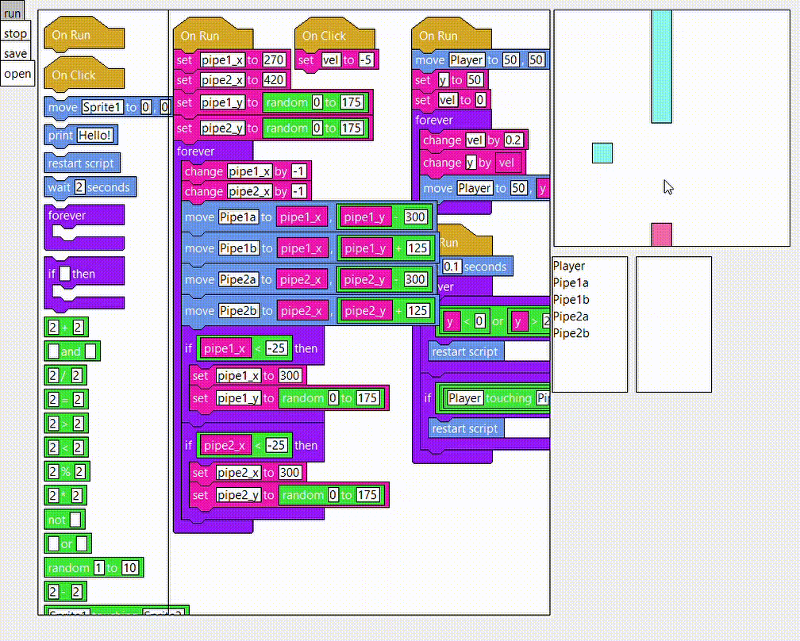

# Scratch

A visual coding tool based off [scratch.mit.edu](https://scratch.mit.edu/). Code can have loops, conditions, variables, events, operations, etc. Code can also manipulate sprites on the screen and make a simple flappy bird game.

Full demo: https://www.youtube.com/watch?v=u6toahR43gg
